# Host Custom UWP Controls in C++ Win32 Project using XAML Islands

This article explains how to modernize C++ Win32 project with custom UWP Controls through XAML Islands in detail. With custom UWP controls, it allows us to define control layout easily through XAML pages. Not only putting standard UWP controls into the custom control, we can also integrate other custom controls as well, such as latest WinUI controls. We will use a new Xaml Application project to bring the custom UWP controls into our C++ Win32 project. This [article](https://docs.microsoft.com/en-us/windows/apps/desktop/modernize/using-the-xaml-hosting-api#host-a-custom-uwp-control) has mentioned how to use the new XAML application in Win32 C++ application, we will give more detailed steps.

Overall, in our solution, we will have two parts to demonstrate this method:

* C++ Win32 Project
* A companion UWP app project that defines a XamlApplication object.  

  In this project, we will define a custom UWP control and export it so that C++ Win32 can use the custom UWP control.

## Development Environment  

* Visual Studio 2019 (16.3.6)  
* Windows 10 1909 (18363.476)  
* Windows 10 SDK (10.0.18362.1)  

## Configure C++ Win32 Project

1. Create C++ Win32 in Visual Studio 2019, will name it SimpleApp

    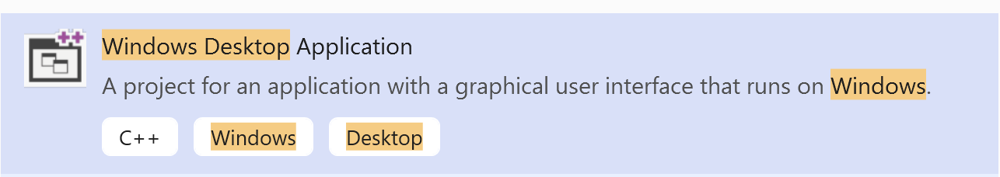

2. In Solution Explorer, right-click the Simple project node,    click **Retarget Project**, select the **10.0.18362.0** or    a later SDK release, and then click OK.
 
   

   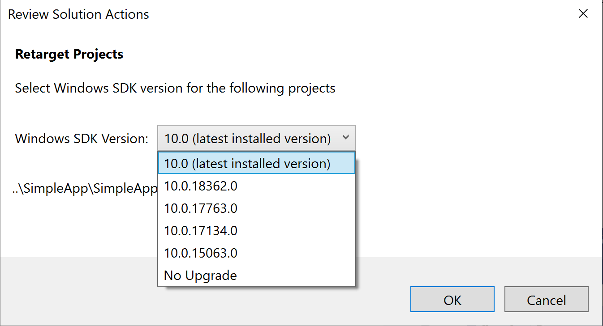
 
3.	Install the ***Microsoft.Windows.CppWinRT*** NuGet package:

    a.	Right-click the project in Solution Explorer and choose ***Manage NuGet Packages***.
    b.	Select the Browse tab, search for the **Microsoft.Windows.CppWinRT** package, and install the latest version of this package.  

    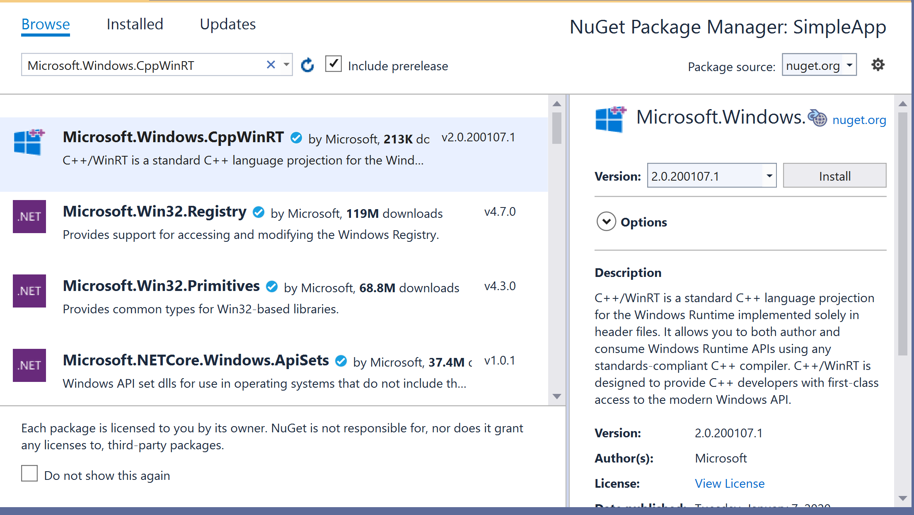


    After install the nuget package, check the SimpleApp project properties, you will notice its C++ version is ISO C++17, which is required by C++/WinRT:

    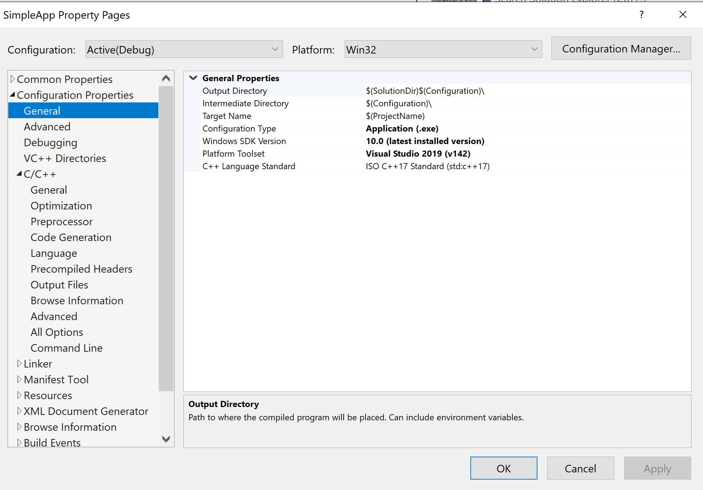
 
    Build this SimpleApp, we can see winrt projected files are generated in the “Generated Files\winrt” folder:

    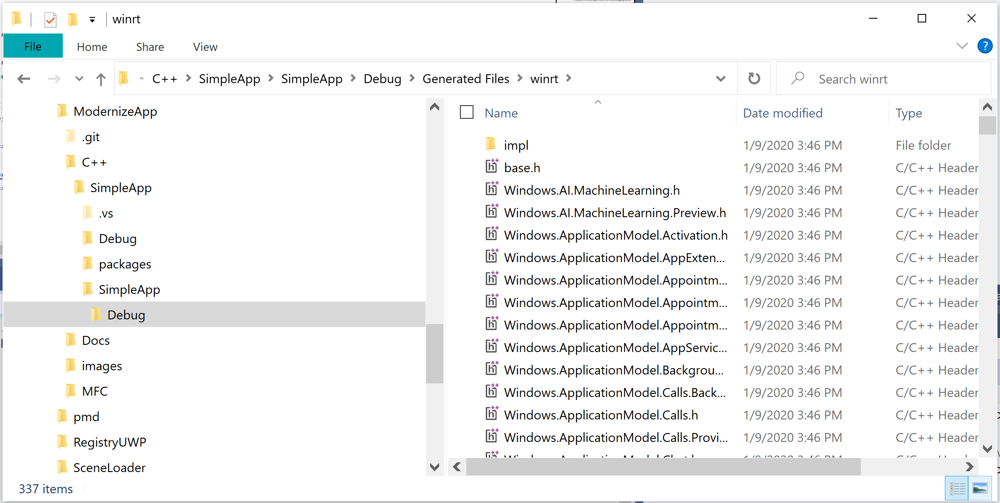
 

4.	Install the **Microsoft.Toolkit.Win32.UI.SDK** NuGet package:

    a.	In the NuGet Package Manager window, make sure that Include prerelease is selected.  
    b.	Select the Browse tab, search for the **Microsoft.Toolkit.Win32.UI.SDK** package, and install version v6.0.0 (or Later) of this package.

    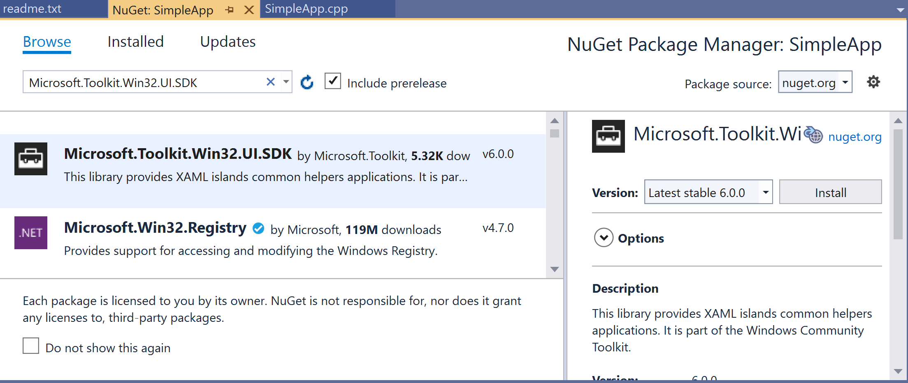

5. Install the ***Microsoft.VCRTForwarders.140*** nuget package as well. Running Custom UWP Control in this project will require VC libs.

   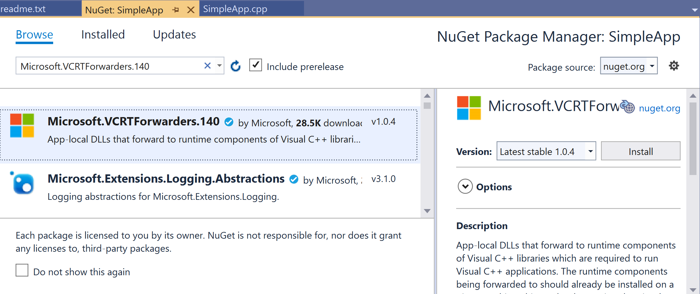

## Configure UWP Project

1. In Solution Explorer, right-click the solution node and select Add -> New Project.

2. Add a Blank App (C++/WinRT) project to your solution. 

     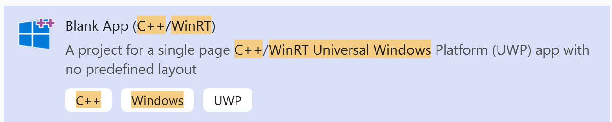

3. Give it a name ***MyApp***, and create it, Make sure the target version and minimum version are ***both*** set to ***Windows 10, version 1903*** or later.

    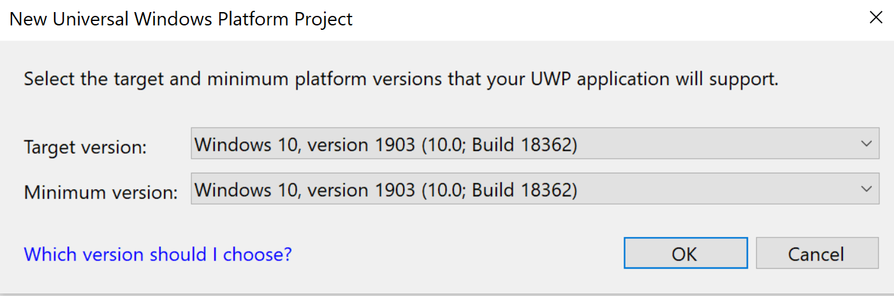

4. Right click the MyApp and open its properties, make sure its C++/WinRT configuration is as below:

     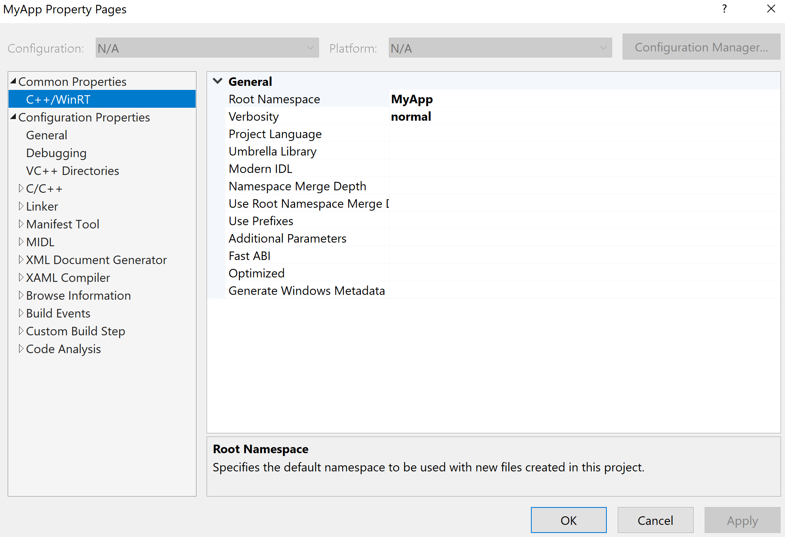

5. Change its output type from .EXE to ***Dynamic Library***

     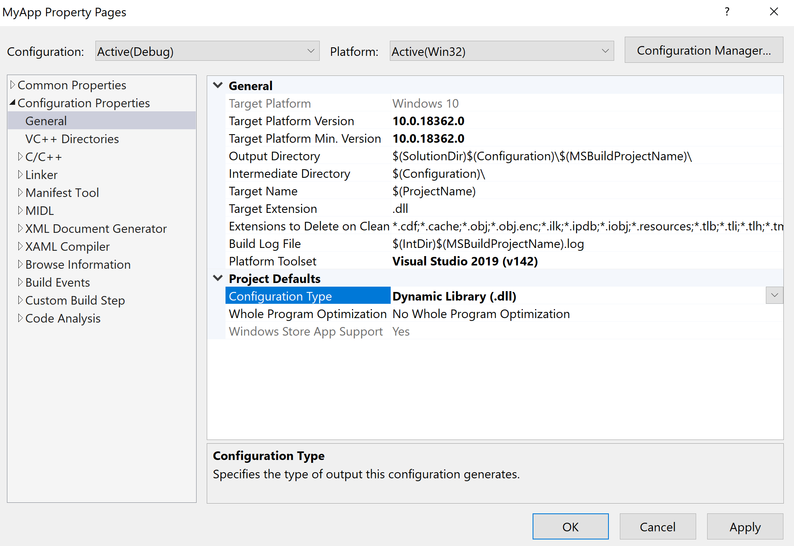

6. Save a dummy.exe into the ***MyApp*** folder. It doesn't need to be a real exe, just input "dummy exe file" in notepad, and save it as ***dummy.exe***. 

     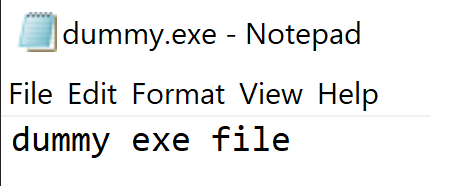

     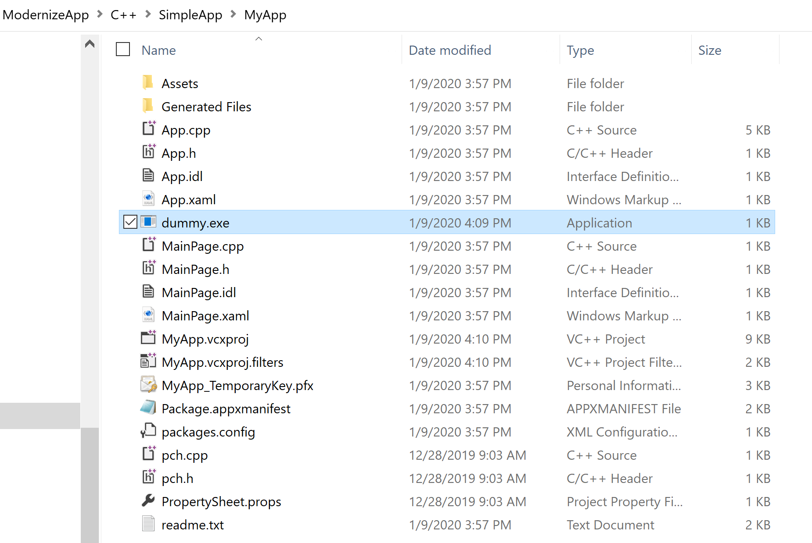

    Add the dummy.exe into MyApp project, and make sure the Content property of dummy.exe is ***True***.

     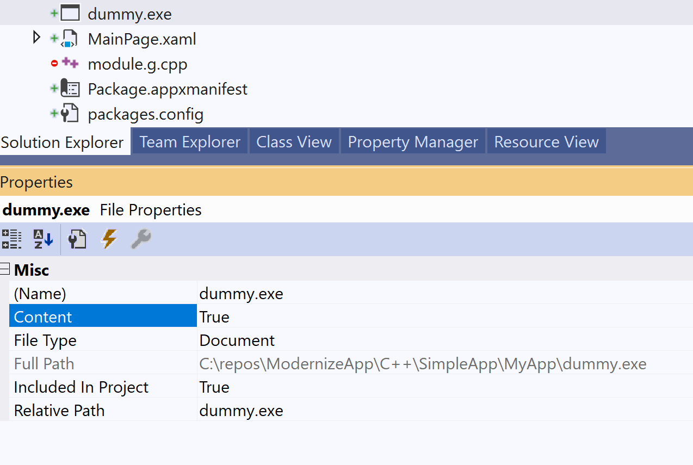

7. Now edit Package.appxmanifest, change the Executable attribute to "dummy.exe"

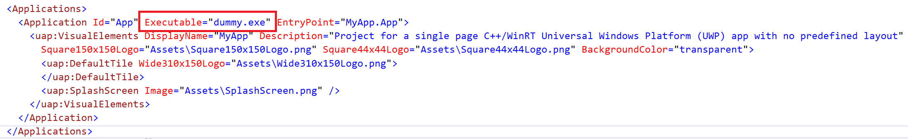

8. Right click the ***MyApp*** project, select ***Unload Project***

9. Right click the ***MyApp (Unloaded)*** project, select ***Edit MyApp.vcxproj***

10. Add below properties to the ***MyApp.vcxproj*** project file:

```XML
<PropertyGroup Label="Globals">
    <WindowsAppContainer>true</WindowsAppContainer>
    <AppxGeneratePriEnabled>true</AppxGeneratePriEnabled>
    <ProjectPriIndexName>App</ProjectPriIndexName>
    <AppxPackage>true</AppxPackage>
  </PropertyGroup>
```

For example:

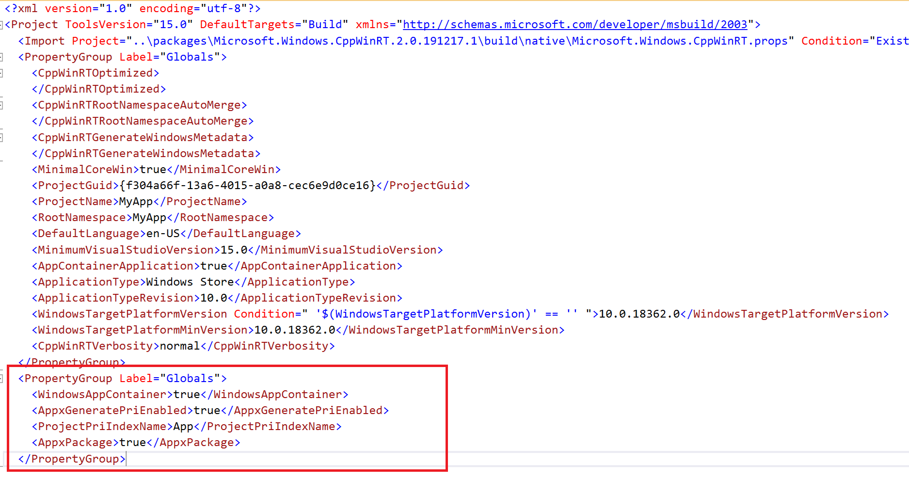

11. Right click the ***MyApp (Unloaded)*** project, select ***Reload Project***.

12. Right click ***Mainpage.xml***, select ***Remove***. And then click ***Delete***

    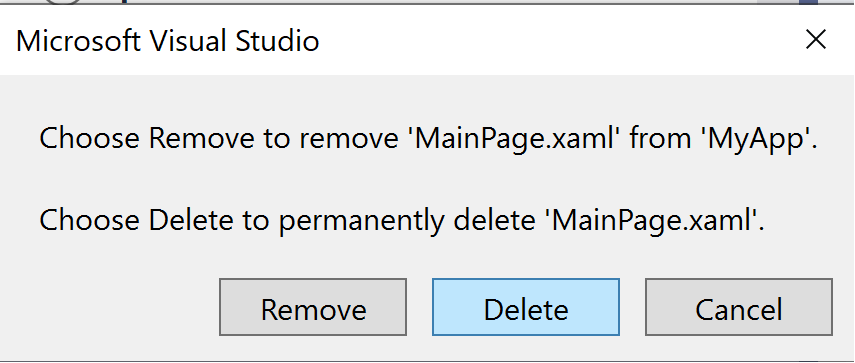

13. Copy App.Xaml, App.cpp, App.h, App.idl contents to overwrite current ones:

***App.Xaml***

```XML
<Toolkit:XamlApplication
    x:Class="MyApp.App"
    xmlns="http://schemas.microsoft.com/winfx/2006/xaml/presentation"
    xmlns:x="http://schemas.microsoft.com/winfx/2006/xaml"
    xmlns:local="using:MyApp"
    xmlns:Toolkit="using:Microsoft.Toolkit.Win32.UI.XamlHost"
    xmlns:d="http://schemas.microsoft.com/expression/blend/2008"
    xmlns:mc="http://schemas.openxmlformats.org/markup-compatibility/2006"
    RequestedTheme="Light"
    mc:Ignorable="d">
</Toolkit:XamlApplication>
```

***App.cpp***
```C++
#include "pch.h"
#include "App.h"

using namespace winrt;
using namespace Windows::UI::Xaml;

namespace winrt::MyApp::implementation
{
    App::App()
    {
        Initialize();

        AddRef();
        m_inner.as<::IUnknown>()->Release();
    }

    App::~App()
    {
        Close();
    }
}

```

***App.h***
```C++
//
// Declaration of the App class.
//

#pragma once

#include "App.g.h"
#include "App.base.h"

namespace winrt::MyApp::implementation
{
    class App : public AppT2<App>
    {
    public:
        App();
        ~App();
    };
}

namespace winrt::MyApp::factory_implementation
{
    class App : public AppT<App, implementation::App>
    {
    };
}

```
***App.idl***
```C++
namespace MyApp
{
    [default_interface]
    runtimeclass App: Microsoft.Toolkit.Win32.UI.XamlHost.XamlApplication
    {
        App();
    }
}

```
14. Create app.base.h in this MyApp project, and use below content:

***app.base.h***

```C++
#pragma once

namespace winrt::MyApp::implementation
{
    template <typename D, typename... I>
    struct App_baseWithProvider : public App_base<D, ::winrt::Windows::UI::Xaml::Markup::IXamlMetadataProvider>
    {
        using IXamlType = ::winrt::Windows::UI::Xaml::Markup::IXamlType;

        IXamlType GetXamlType(::winrt::Windows::UI::Xaml::Interop::TypeName const& type)
        {
            return AppProvider()->GetXamlType(type);
        }

        IXamlType GetXamlType(::winrt::hstring const& fullName)
        {
            return AppProvider()->GetXamlType(fullName);
        }

        ::winrt::com_array<::winrt::Windows::UI::Xaml::Markup::XmlnsDefinition> GetXmlnsDefinitions()
        {
            return AppProvider()->GetXmlnsDefinitions();
        }

    private:
        bool _contentLoaded{ false };
        std::shared_ptr<XamlMetaDataProvider> _appProvider;
        std::shared_ptr<XamlMetaDataProvider> AppProvider()
        {
            if (!_appProvider)
            {
                _appProvider = std::make_shared<XamlMetaDataProvider>();
            }
            return _appProvider;
        }
    };

    template <typename D, typename... I>
    using AppT2 = App_baseWithProvider<D, I...>;
}


```

14. Install [Microsoft.Toolkit.Win32.UI.XamlApplication](https://www.nuget.org/packages/Microsoft.Toolkit.Win32.UI.XamlApplication) Nuget package.

15. If you build ***MyApp*** now, it should create MyApp.dll without any error.

## Centralize Output, Input and C++/WinRT files in Solution

This step is necessary for our next steps because we need to include winrt header files in different projects properly, and MFCApp also needs to reference MyApp resource files.

1. Add a new ***Solution.Props*** file by right clicking the ***solution*** node, and select Add -> New Item:

    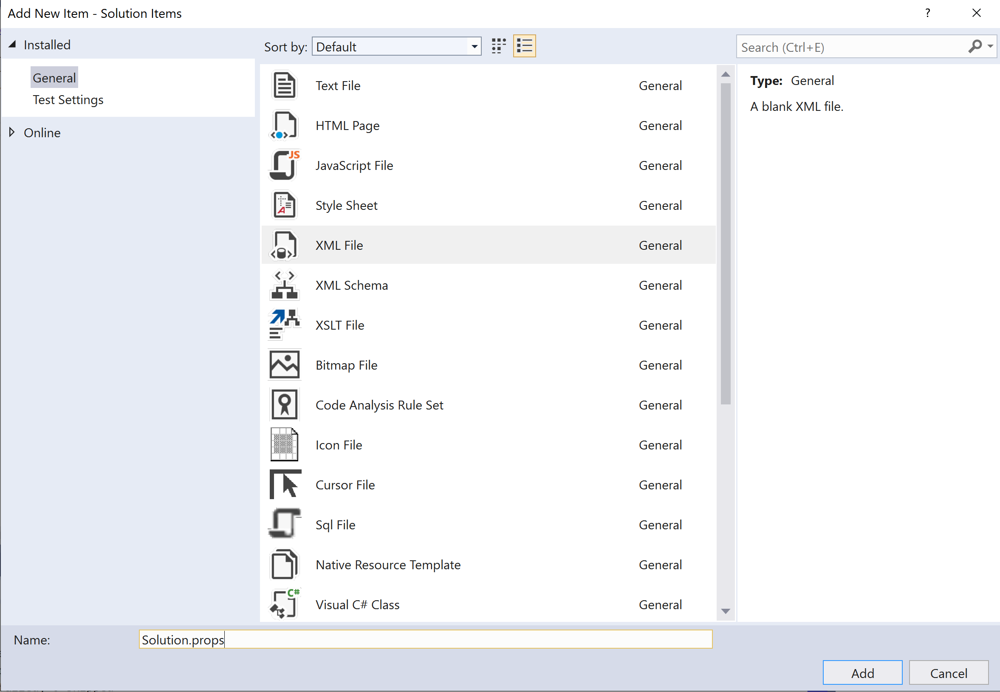

2. Use below content to overwrite the Solution.Props:

```XML
<?xml version="1.0" encoding="utf-8"?>
<Project xmlns="http://schemas.microsoft.com/developer/msbuild/2003">
  <PropertyGroup>
    <IntDir>$(SolutionDir)\obj\$(Platform)\$(Configuration)\$(MSBuildProjectName)\</IntDir>
    <OutDir>$(SolutionDir)\bin\$(Platform)\$(Configuration)\$(MSBuildProjectName)\</OutDir>
    <GeneratedFilesDir>$(IntDir)Generated Files\</GeneratedFilesDir>
  </PropertyGroup>
</Project>
```
3. Click Views -> Other Windows -> Property Manager

    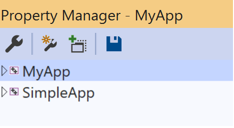

4. Right click ***SimpleApp***, select ***Add Existing Property Sheet***, add the new ***solution.props*** file

    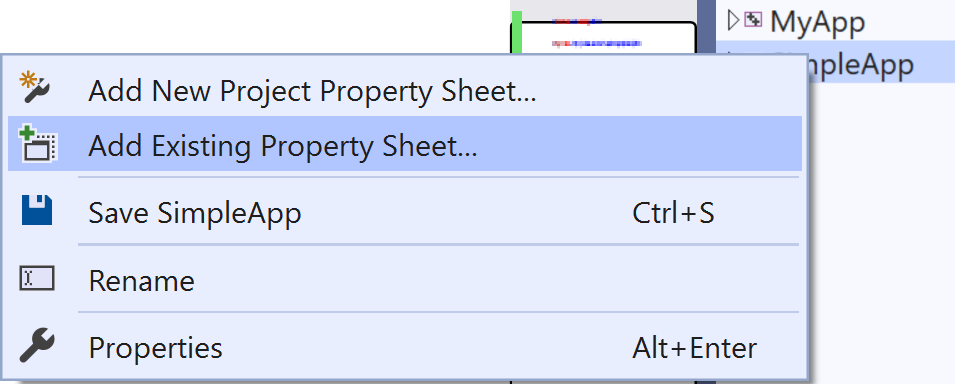

5. Repeat the step 4. for ***MyApp***. We can close the Property Manager window now.

6. Right click the project node ***MFCApp***, select Properties. 

If you see the Outut and Intermidiate directries are already become as below, then can skip this step:

$(SolutionDir)\bin\$(Platform)\$(Configuration)\$(MSBuildProjectName)\
and
$(SolutionDir)\obj\$(Platform)\$(Configuration)\$(MSBuildProjectName)\
    
Otherwise please manually set：

Output Directory:
$(OutDir)

Intermidia Directory:
$(IntDir)

 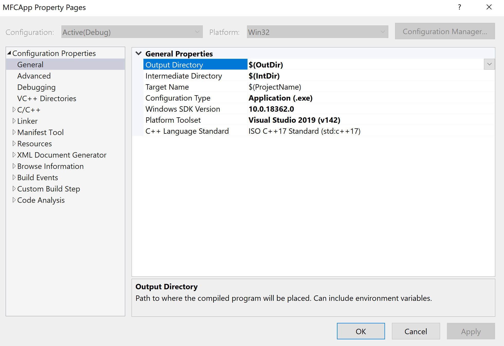

7. Repeat the step 6 for ***MyApp***.

8. Right click the Solution node, and choose ***Project Dependencies***, make sure SimpleApp depends on MyApp:

     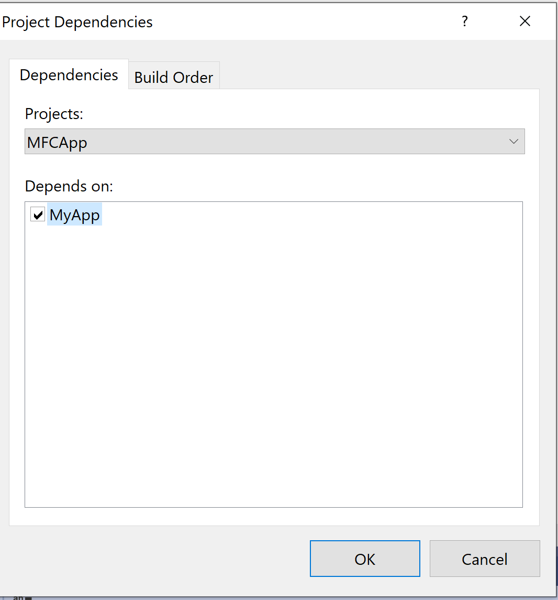

9. Rebuild the whole solution, it should work without errors.


## Add UWP Custom XAML Control to MyApp

1. Right click ***MyApp***, select Add -> New Item
2. Create ***Blank User Conrol (C++/WinRT)***, here we call it MainUserControl:

    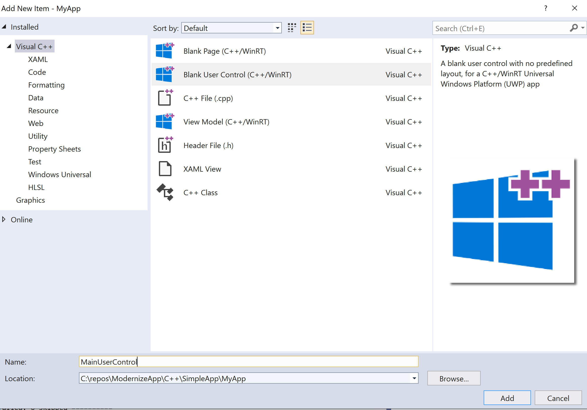

## Integrate Custom XAML Control in SimpleApp

1. Add one XML file **app.manifest** in your project with below content to register custom control type:

```XML
<?xml version="1.0" encoding="utf-8" standalone="yes"?>
<assembly
    xmlns="urn:schemas-microsoft-com:asm.v1"
    xmlns:asmv3="urn:schemas-microsoft-com:asm.v3"
    manifestVersion="1.0">
    <asmv3:file name="MyApp.dll">
        <activatableClass
            name="MyApp.App"
            threadingModel="both"
            xmlns="urn:schemas-microsoft-com:winrt.v1" />
        <activatableClass
            name="MyApp.XamlMetadataProvider"
            threadingModel="both"
            xmlns="urn:schemas-microsoft-com:winrt.v1" />
        <activatableClass
            name="MyApp.MainUserControl"
            threadingModel="both"
            xmlns="urn:schemas-microsoft-com:winrt.v1" />
    </asmv3:file>
</assembly>
```
2.  Now the project structure is like as below:

    

3. Right click the Win32 Project ***SimpleApp***, select ***Unload Project***

4. Right click the ***SimpleApp (Unloaded)*** project, select ***Edit SimpleApp.vcxproj***

5. Remove the three lines from the ***SimpleApp.vcxproj*** project file:

```XML
<ItemGroup>
    <Manifest Include="app.manifest" />
</ItemGroup>
```

Add below properties to the ***SimpleApp.vcxproj*** project file before the ***"<Import Project=""$(VCTargetsPath)\Microsoft.Cpp.targets" />"*** line:

```XML
  <ItemGroup>
    <Manifest Include="app.manifest" />
    <AppxManifest Include="$(SolutionDir)\bin\$(Platform)\$(Configuration)\$(AppProjectName)\AppxManifest.xml" />
  </ItemGroup>
  <PropertyGroup>
    <AppProjectName>MyApp</AppProjectName>
  </PropertyGroup>
  <PropertyGroup>
    <AppIncludeDirectories>$(SolutionDir)\obj\$(Platform)\$(Configuration)\$(AppProjectName)\;$(SolutionDir)\obj\$(Platform)\$(Configuration)\$(AppProjectName)\Generated Files\;</AppIncludeDirectories>
  </PropertyGroup>
    <ItemGroup>
    <NativeReferenceFile Include="$(SolutionDir)\bin\$(Platform)\$(Configuration)\$(AppProjectName)\*.xbf">
      <DeploymentContent>true</DeploymentContent>
      <CopyToOutputDirectory>PreserveNewest</CopyToOutputDirectory>
    </NativeReferenceFile>
    <NativeReferenceFile Include="$(SolutionDir)\bin\$(Platform)\$(Configuration)\$(AppProjectName)\*.dll">
      <DeploymentContent>true</DeploymentContent>
      <CopyToOutputDirectory>PreserveNewest</CopyToOutputDirectory>
    </NativeReferenceFile>
    <NativeReferenceFile Include="$(SolutionDir)\bin\$(Platform)\$(Configuration)\$(AppProjectName)\resources.pri">
      <DeploymentContent>true</DeploymentContent>
      <CopyToOutputDirectory>PreserveNewest</CopyToOutputDirectory>
    </NativeReferenceFile>
  </ItemGroup>
  <------Right Here--------->
  <Import Project="$(VCTargetsPath)\Microsoft.Cpp.targets" />
```

6. Right click the ***SimpleApp (Unloaded)*** project, select ***Reload Project***.

7. Right click ***SimpleApp***, select ***Properties***, setup ***$(AppIncludeDirectories)*** as a part of include file path, this macro has been defined in the above project file:

     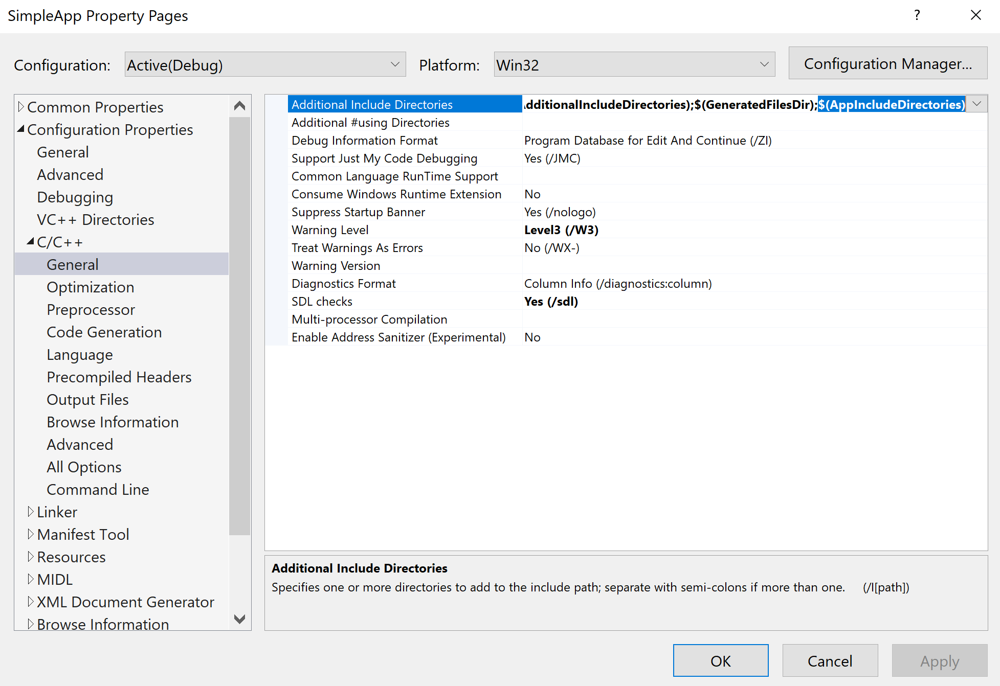

8. Set ***"Per Monitor DPI Aware"*** for ***DPI Awareness*** otherwise you may be not able to start this SimpleApp when it is ***"High DPI Aware"*** and hit configuration error in Manifest:
    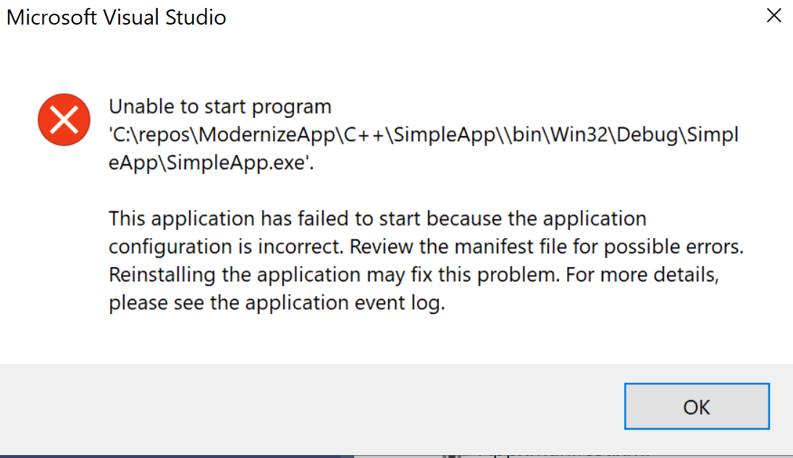

    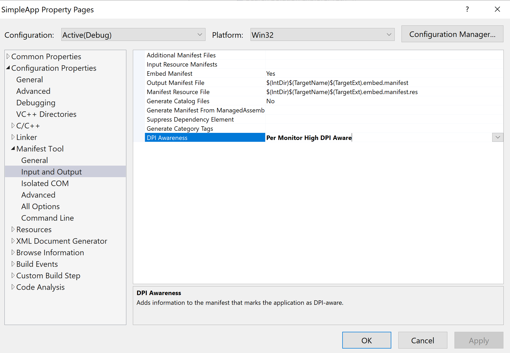

9. Open framework.h, remove this #define:

    ```C++
    #define WIN32_LEAN_AND_MEAN
    ````

10. In SimpleApp.h, add below code to include necessary winrt header files:

    ```C++
    #include <winrt/Windows.Foundation.Collections.h>
    #include <winrt/Windows.system.h>
    #include <winrt/windows.ui.xaml.hosting.h>
    #include <windows.ui.xaml.hosting.desktopwindowxamlsource.h>
    #include <winrt/windows.ui.xaml.controls.h>
    #include <winrt/Windows.ui.xaml.media.h>
    #include <winrt/Windows.UI.Core.h>
    #include <winrt/myapp.h>
    ```
    
 11.   Using winrt namespaces in SimpleAPP.cpp

    ```C++
    using namespace winrt;
    using namespace Windows::UI;
    using namespace Windows::UI::Composition;
    using namespace Windows::UI::Xaml::Hosting;
    using namespace Windows::Foundation::Numerics;
    using namespace Windows::UI::Xaml::Controls;
    ```

12.  Declare hostApp, _desktopWindowXamlSource and our custom control in ***SimpleApp.cpp***

```C++
    UNREFERENCED_PARAMETER(hPrevInstance);
    UNREFERENCED_PARAMETER(lpCmdLine);

    // TODO: Place code here.
    winrt::init_apartment(winrt::apartment_type::single_threaded);
    hostApp = winrt::MyApp::App{};
    _desktopWindowXamlSource = winrt::Windows::UI::Xaml::Hosting::DesktopWindowXamlSource{};
```

13. Initalize hostApp, _desktopWindowXamlSource in ***wWinMain*** in ***SimpleApp.CPP***

```C++
	winrt::init_apartment(winrt::apartment_type::single_threaded);
    hostApp = winrt::MyApp::App{};
    _desktopWindowXamlSource = winrt::Windows::UI::Xaml::Hosting::DesktopWindowXamlSource{};
```

14. Add below code in ***InitInstance*** in ***SimpleApp.cpp***

    ```C++
        if (_desktopWindowXamlSource != nullptr)
       {
           // Get handle to corewindow
           auto interop = _desktopWindowXamlSource.as<IDesktopWindowXamlSourceNative>();
           // Parent the DesktopWindowXamlSource object to current window
           check_hresult(interop->AttachToWindow(hWnd));
    
           // This Hwnd will be the window handler for the Xaml Island: A child window that contains Xaml.  
           HWND hWndXamlIsland = nullptr;
           // Get the new child window's hwnd 
           interop->get_WindowHandle(&hWndXamlIsland);
    
           RECT windowRect;
           ::GetWindowRect(hWnd, &windowRect);
           ::SetWindowPos(hWndXamlIsland, NULL, 0, 0, windowRect.right - windowRect.left, windowRect.bottom - windowRect.top, SWP_SHOWWINDOW);
    
           _mainUserControl = winrt::MyApp::MainUserControl();
           _desktopWindowXamlSource.Content(_mainUserControl);
       }
       ShowWindow(hWnd, nCmdShow);
       UpdateWindow(hWnd);
    ```
15. Clean up resources when the view is disconstructed in MFCAppView.cpp


    ```C++
     case WM_DESTROY:
        PostQuitMessage(0);
        if (_desktopWindowXamlSource != nullptr)
        {
            _desktopWindowXamlSource.Close();
            _desktopWindowXamlSource = nullptr;
        }
        break;
    ```

16.  Add AdjustLayout function to make XAML content layout properly in SimpleApp.cpp
:

    ```C++
    void AdjustLayout(HWND hWnd)
    {
        if (_desktopWindowXamlSource != nullptr)
        {
            auto interop = _desktopWindowXamlSource.as<IDesktopWindowXamlSourceNative>();
            HWND xamlHostHwnd = NULL;
            check_hresult(interop->get_WindowHandle(&xamlHostHwnd));
    
            RECT windowRect;
            ::GetWindowRect(hWnd, &windowRect);
            ::SetWindowPos(xamlHostHwnd, NULL, 0, 0, windowRect.right - windowRect.left, windowRect.bottom - windowRect.top, SWP_SHOWWINDOW);
        }
    }
    ```
17.  In SimpleApp.CPP handle WM_SIZE in the ***WinProc*** function: 
    ```C++
        case WM_SIZE:
            AdjustLayout(hWnd);
    ```C++
18. Now you can build and run this SimpleApp. It should display a button in the central of view window:

    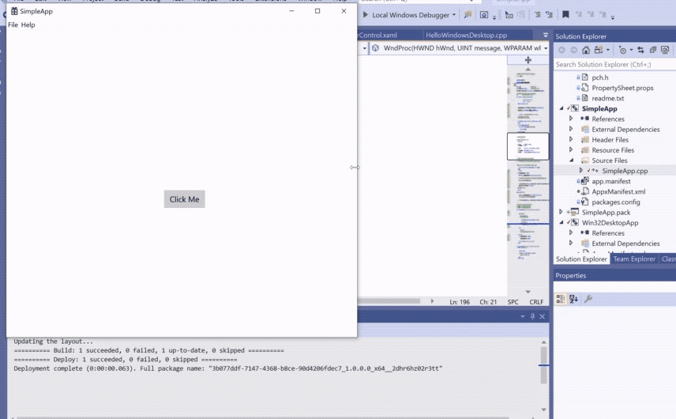

## Using Ink Control in MyApp UWP Project

1. Add an ***Assets*** file folder under ***SimpleApp*** on file system, add viewbackground.png file. And then create a new filter of "Assets", add this existing viewbackground.png into the ***Assets*** filter:
    
    Set the file's **Content** property as **True**

    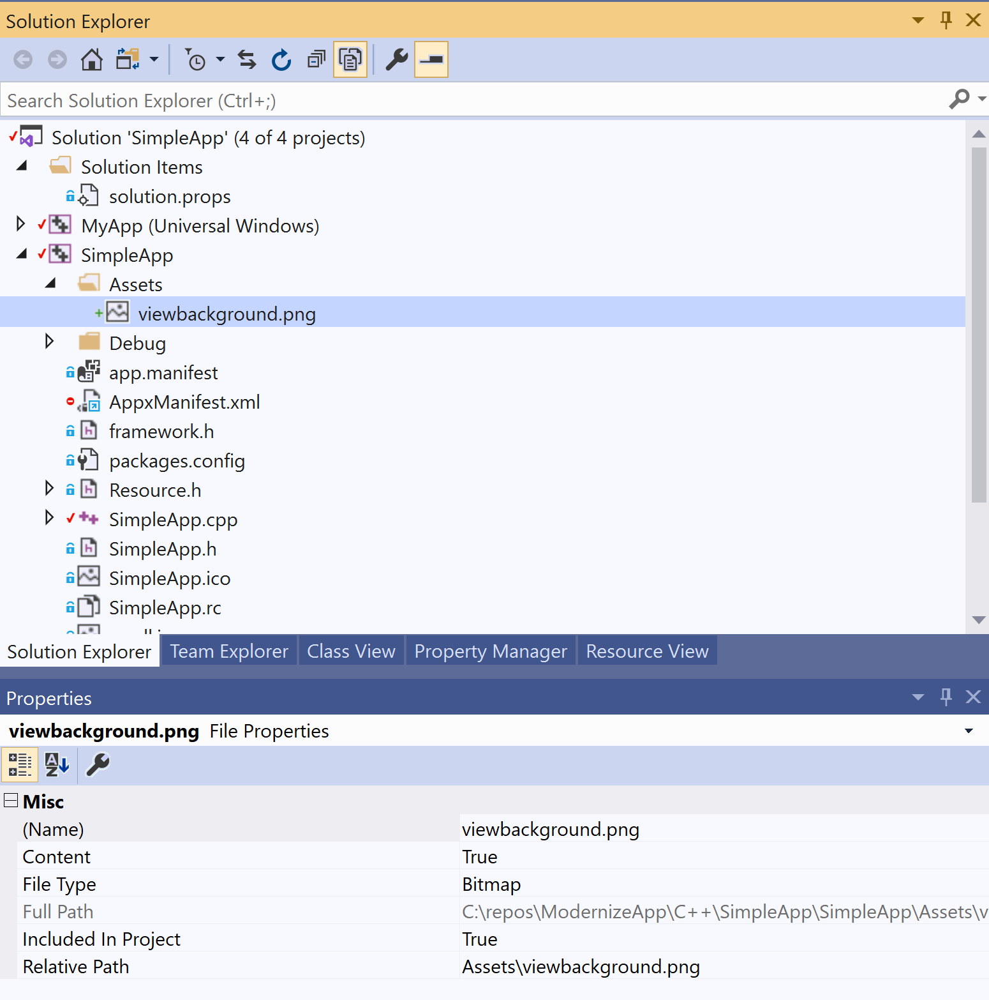

    > If you cannot see the ***viewbackground.png*** file, please click the "Show All Files" tool icon in the solution explorer window.

2. Add the sample png file into ***Assets*** folder of ***MyApp***, and make its ***Content*** property as **True** as well.

3. Modify MainUserControl.Xaml as below in ***MyApp***:

```XML
<UserControl
    x:Class="MyApp.MainUserControl"
    xmlns="http://schemas.microsoft.com/winfx/2006/xaml/presentation"
    xmlns:x="http://schemas.microsoft.com/winfx/2006/xaml"
    xmlns:local="using:MyApp"
    xmlns:d="http://schemas.microsoft.com/expression/blend/2008"
    xmlns:mc="http://schemas.openxmlformats.org/markup-compatibility/2006"
    mc:Ignorable="d">

    <RelativePanel HorizontalAlignment="Stretch" VerticalAlignment="Stretch">
        <Image Source="assets/viewbackground.png" RelativePanel.AlignLeftWithPanel="True" 
               RelativePanel.AlignRightWithPanel="True"
               RelativePanel.AlignHorizontalCenterWithPanel="True"></Image>
        <InkCanvas x:Name="ic" RelativePanel.AlignLeftWithPanel="True" 
                   RelativePanel.AlignRightWithPanel="True" 
                   RelativePanel.AlignBottomWithPanel="True"
                   RelativePanel.AlignTopWithPanel="True"></InkCanvas>
        <InkToolbar x:Name="it" HorizontalAlignment="Left" VerticalAlignment="Top"></InkToolbar>
    </RelativePanel>
</UserControl>

```

4. Add below code in MainUserControl.CPP, remove the Button ClickHandler code as we don't use it now:

    ```C++
        MainUserControl::MainUserControl()
        {
            InitializeComponent();
            ic().InkPresenter().InputDeviceTypes((winrt::Windows::UI::Core::CoreInputDeviceTypes)7);
            it().TargetInkCanvas(ic());
        }
    ```

5. Include more winrt header files in MainUserControl.h:

    ```C++
    #include <winrt/Windows.UI.Input.Inking.h>
    #include <winrt/Windows.UI.Xaml.Media.Imaging.h>
    ```
6. Build and run Simple, if steps have been taken exactly as above, it will show as below:

    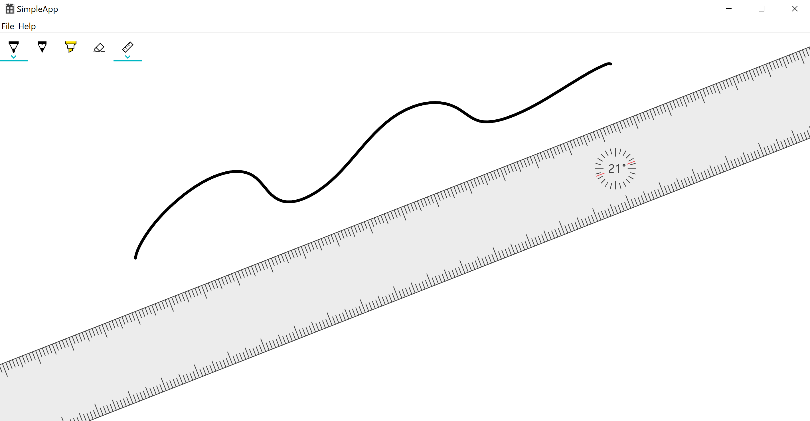

7. You may notice that it doesn't display the background image, this is because the uri **assets/viewbackground.png** needs to be used UWP package. In Visual Studio, with **"Windows Application Packaging Project (C++)"**, it is easily to packaging our SimpleApp project:

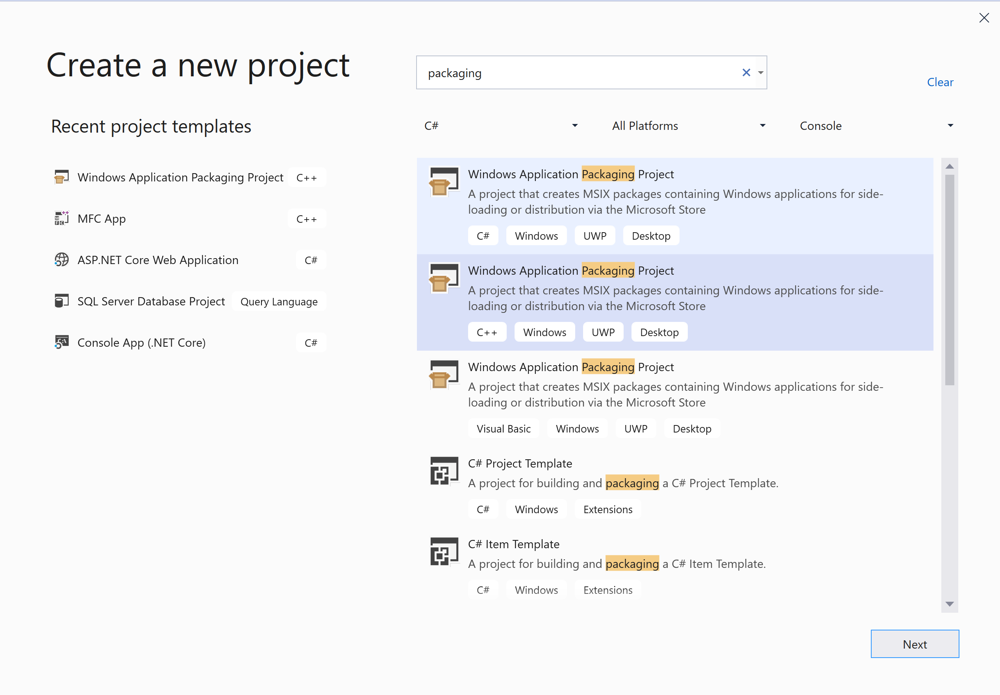

Create the packaging project in the solution, right click the **Application** node, and select **Add Reference**, add SimpleApp. Now the packaging project structure is like:

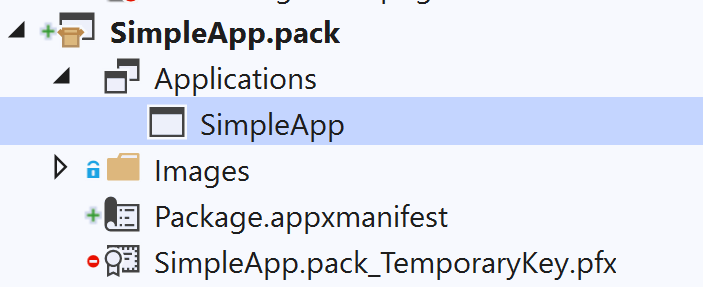

For more information about packaging project, refer to:
[Package a desktop app from source code using Visual Studio](https://docs.microsoft.com/en-us/windows/msix/desktop/desktop-to-uwp-packaging-dot-net)

After this, choose the packaging project as Start Up project, Ctrl+F5 to run it. We can see the expected result will show up:

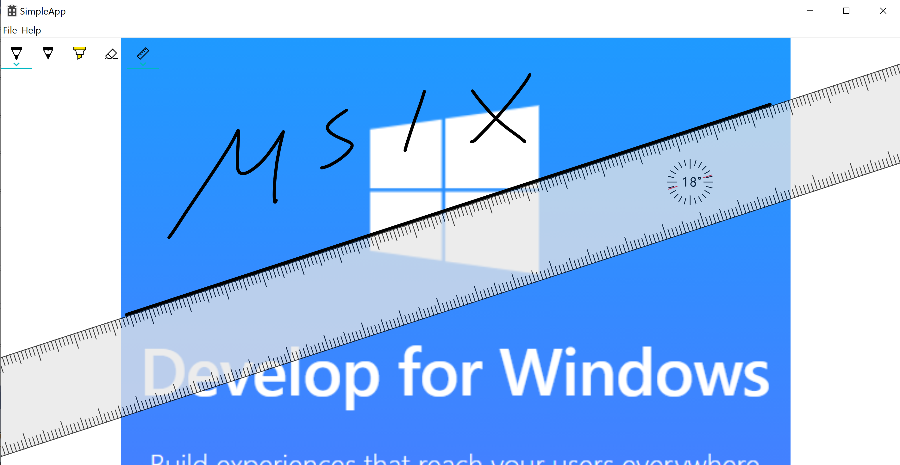

Further more, you can publish this packaging app as MSIX or APPX, and easily deploy it:

[Package a UWP app with Visual Studio](https://docs.microsoft.com/en-us/windows/msix/desktop/desktop-to-uwp-r2r)

## Wrap Up
This article gives detailed steps on how to leverage XamplApplication to host standard XAML control in C++ Win32 project, with this method, it is flexible to leverage Win10 Controls in Win32 project. The whole sample solution can be found from this repo: https://github.com/freistli/ModernizeApp/tree/master/C%2B%2B/SimpleApp