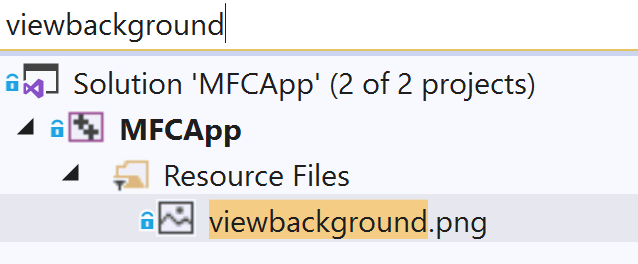
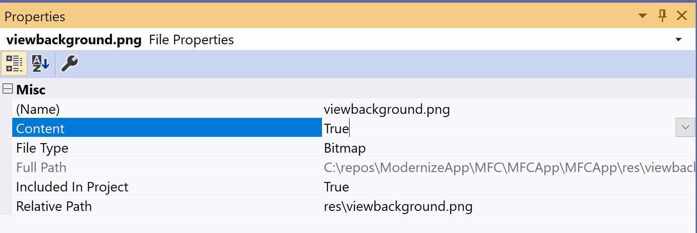
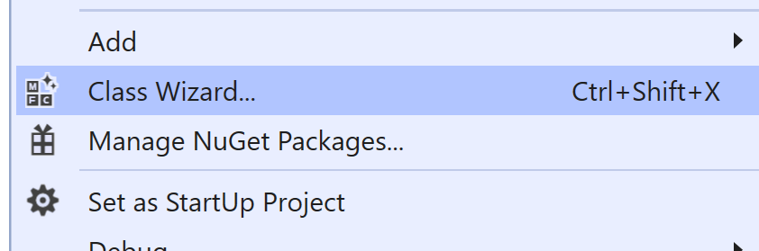
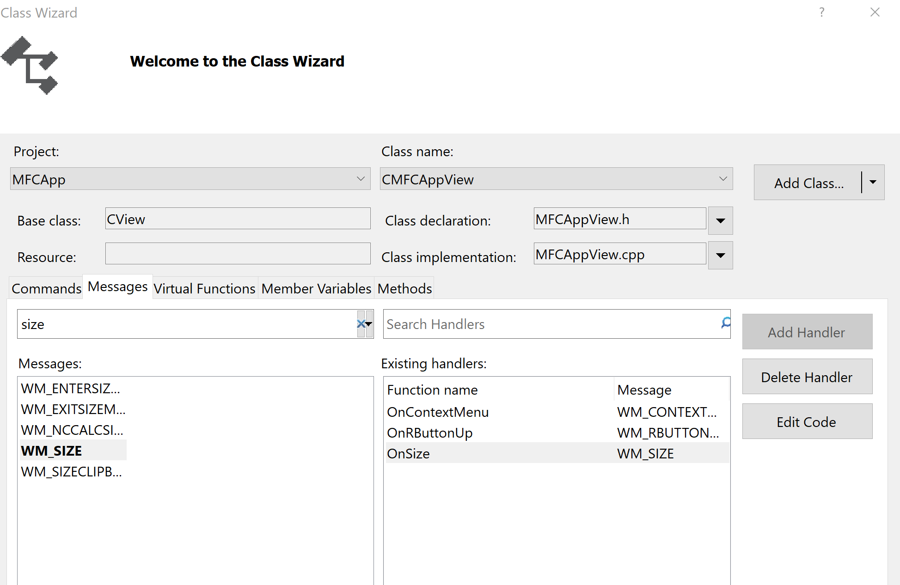
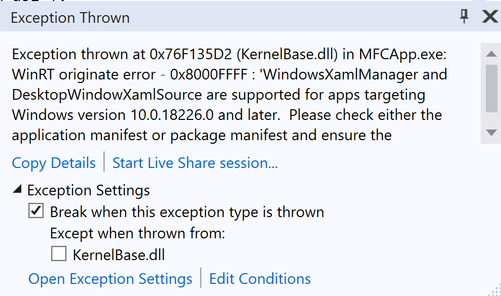
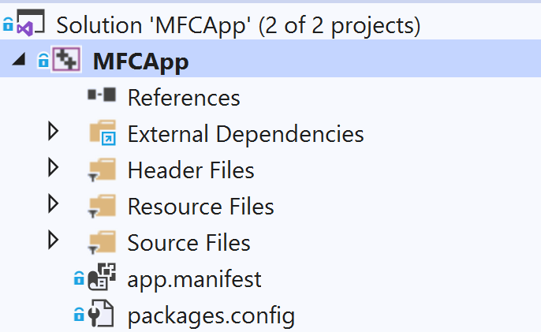
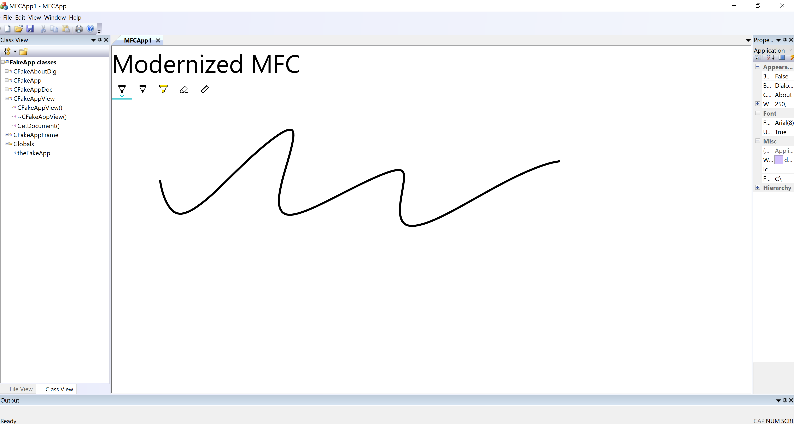
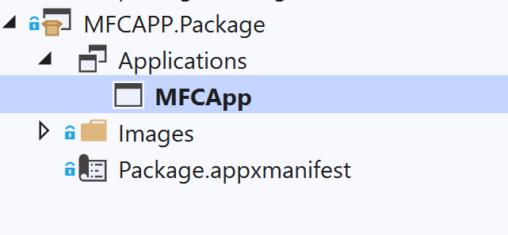
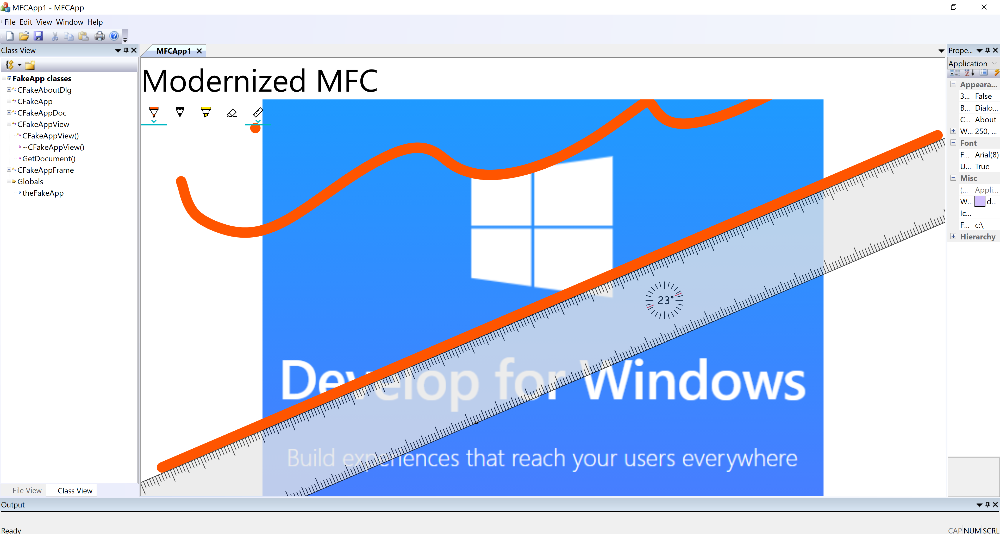

# Host standard UWP controls in MFC MDI project using XAML Islands

This article will help developers to understand how to modernize MFC MDI project with Standard UWP Controls through XMAL Islands. In this sample, we will add XAML RelativePanel, UWP Ink canvas and toolbar into the document view of this MFC MDI project. The sample MFCAPP solution is [here](https://github.com/freistli/ModernizeApp/tree/master/MFC/MFCApp)

It brings Fluent UI to non-UWP desktops.
Although MFC uses specific framework, it does support C++/WinRT as well. It aligns the pre-requirements and API architecture described in the article [Using the UWP XAML hosting API in a C++ Win32 app](https://docs.microsoft.com/en-us/windows/apps/desktop/modernize/using-the-xaml-hosting-api). Here we mainly explain the specific modernization parts for MFC project.

## Development Environment

* Visual Studio 2019 (16.3.6)  
* Windows 10 1909 (18363.476)  
* Windows 10 SDK (10.0.18362.1) 

## Configure Project

1. Create MFC App in Visual Studio 2019, will name it MFCAPP

    

    Use below configuration to create the MFCAPP project
    
    

    click **Finish** Build and Run it, here is its default UI

     

    
  
2. In Solution Explorer, right-click the MFCAPP project node,    click **Retarget Project**, select the **10.0.18362.0** or    a later SDK release, and then click OK.
 
   

   
 
3.	Install the Microsoft.Windows.CppWinRT NuGet package:

    a.	Right-click the project in Solution Explorer and choose Manage NuGet Packages.
    b.	Select the Browse tab, search for the **Microsoft.Windows.CppWinRT** package, and install the latest version of this package.  

      


    After install the nuget package, check the MFC project properties, you will notice its C++ version is ISO C++17, which is required by C++/WinRT:

    
 
    Build this MFCApp, we can see winrt projected files are generated in the “Generated Files\winrt” folder:

    
 

4.	Install the **Microsoft.Toolkit.Win32.UI.SDK** NuGet          package:

    a.	In the NuGet Package Manager window, make sure that Include prerelease is selected.  
    b.	Select the Browse tab, search for the **Microsoft.Toolkit.Win32.UI.SDK** package, and install version v6.0.0 (or Later) of this package.

    

## Use XAML hosting APIs to host  UWP controls in MFC Document View

1.  Open pch.h, add below code to include necessary winrt header files:

    ```C++
    #pragma push_macro("GetCurrentTime")
    #pragma push_macro("TRY")
    #undef GetCurrentTime
    #undef TRY

    #include <winrt/Windows.Foundation.Collections.h>
    #include <winrt/Windows.system.h>
    #include <winrt/windows.ui.xaml.hosting.h>
    #include <windows.ui.xaml.hosting.desktopwindowxamlsource.h>
    #include <winrt/windows.ui.xaml.controls.h>
    #include <winrt/Windows.ui.xaml.media.h>
    #include <winrt/Windows.UI.Core.h>
    #include <winrt/Windows.UI.Input.Inking.h>
    #include <winrt/Windows.UI.Xaml.Media.Imaging.h>
    #pragma pop_macro("TRY")
    #pragma pop_macro("GetCurrentTime")
    ```
    Regarding the reason of using “GetCurrentTime” and “TRY” macros, please refer to:
    https://docs.microsoft.com/en-us/windows/uwp/cpp-and-winrt-apis/faq

2.	Using winrt namespaces in MFCAPPView.h and MFCAPP.h

    ```C++
    using namespace winrt;
    using namespace Windows::UI;
    using namespace Windows::UI::Composition;
    using namespace Windows::UI::Xaml::Hosting;
    using namespace Windows::Foundation::Numerics;
    using namespace Windows::UI::Xaml::Controls;
    ```
3.  Declare DesktopWindowXamlSource member and AdjustLayout       methods in MFCAPPView.h:

    ```C++
    private:
        DesktopWindowXamlSource _desktopWindowXamlSource{ nullptr };
        
        RelativePanel xamlContainer = RelativePanel{ nullptr };
        TextBlock tb = TextBlock{ nullptr };
        Image image = Image{ nullptr };
        InkCanvas ic = InkCanvas{ nullptr };
        InkToolbar it = InkToolbar{ nullptr };

    public:
        void AdjustLayout();
    ```

 4. Initialize WindowsXamlManager in MFCApp instance.
 
    Add WindowsXamlManager member in MFCAPP.h:

    ```C++
    WindowsXamlManager winxamlmanager = WindowsXamlManager{ nullptr };
    ```

    And initialize XMAL framework core window in MFCAPP.CPP:

    ```C++
    //Initialize the XAML framework's core window for the current thread.
    BOOL CMFCAppApp::InitInstance()
    {
        ...
        winxamlmanager = WindowsXamlManager::InitializeForCurrentThread();
        ...
    }
    ```

5.  In MFCAPPView.CPP, add code into the CMFCAppView::OnDraw function, it adds XAML RelativePanel, TextBox, InkCanvas, and InkToolbar, and a background image into the default document view:

    ```C++
    if (_desktopWindowXamlSource == nullptr)
	{
		//XAML Island section
		

		// This Hwnd will be the window handler for the Xaml Island: A child window that contains Xaml.  
		HWND hWndXamlIsland = nullptr;

		// This DesktopWindowXamlSource is the object that enables a non-UWP desktop application 
		// to host UWP controls in any UI element that is associated with a window handle (HWND).
		_desktopWindowXamlSource = DesktopWindowXamlSource{ };

		// Get handle to corewindow
		auto interop = _desktopWindowXamlSource.as<IDesktopWindowXamlSourceNative>();
		// Parent the DesktopWindowXamlSource object to current window
		check_hresult(interop->AttachToWindow(this->GetSafeHwnd()));

		// Get the new child window's hwnd 
		interop->get_WindowHandle(&hWndXamlIsland);

		RECT size;
		GetWindowRect(&size);
		auto viewWidth = size.right - size.left;
		auto viewHeight = size.bottom - size.top;

		//Creating the Xaml content
		xamlContainer = RelativePanel{};
		
		// Update the xaml island window size becuase initially is 0,0
		::SetWindowPos(hWndXamlIsland, NULL, 0, 0, viewWidth, viewHeight, SWP_SHOWWINDOW);

		tb = TextBlock{};
		tb.Text(L"Modernized MFC");
		tb.VerticalAlignment(Windows::UI::Xaml::VerticalAlignment::Center);
		tb.HorizontalAlignment(Windows::UI::Xaml::HorizontalAlignment::Center);
		tb.FontSize(48);
		xamlContainer.Children().Append(tb);
		
		image = Image{};
		Windows::Foundation::Uri uri(L"ms-appx:///res/viewbackground.png");
		Windows::UI::Xaml::Media::Imaging::BitmapImage bitmapImage(uri);
		image.Source(bitmapImage);

		xamlContainer.Children().Append(image);
		xamlContainer.SetAlignLeftWithPanel(image, true);
		xamlContainer.SetAlignRightWithPanel(image, true);
		xamlContainer.SetBelow(image, tb);
				
		ic = InkCanvas{};
		ic.InkPresenter().InputDeviceTypes(winrt::Windows::UI::Core::CoreInputDeviceTypes::Touch | winrt::Windows::UI::Core::CoreInputDeviceTypes::Mouse);
		xamlContainer.SetAlignLeftWithPanel(ic, true);
		xamlContainer.SetBelow(ic, tb);
		xamlContainer.SetAlignBottomWithPanel(ic, true);
		xamlContainer.SetAlignRightWithPanel(ic, true);
		xamlContainer.Children().Append(ic);

		it = InkToolbar{};
		xamlContainer.Children().Append(it);
		xamlContainer.SetAlignLeftWithPanel(it, true);
		xamlContainer.SetBelow(it, tb);
		it.TargetInkCanvas(ic);
		
		xamlContainer.UpdateLayout();
		_desktopWindowXamlSource.Content(xamlContainer);
		AdjustLayout();
	}
    ```

    Meanwhile, put a **viewbackground.png** in the Res folder. And add this existing item into the Resources folder of project:
    
    

    Set the file's **Content** property as **True**

    

6. Clean up resources when the view is disconstructed

    ```C++
    CMFCAppView::~CMFCAppView()
    {
        if (_desktopWindowXamlSource != nullptr)
        {
            _desktopWindowXamlSource.Close();
            _desktopWindowXamlSource = nullptr;
        }
    }
    ```

7.  Add AdjustLayout function to make XAML content layout properly:

    ```C++
    void CMFCAppView::AdjustLayout()
    {
        if (_desktopWindowXamlSource != nullptr)
        {
            auto interop = _desktopWindowXamlSource.as<IDesktopWindowXamlSourceNative>();
            HWND xamlHostHwnd = NULL;
            check_hresult(interop->get_WindowHandle(&xamlHostHwnd));

            RECT windowRect;
            GetWindowRect(&windowRect);
            ::SetWindowPos(xamlHostHwnd, NULL, 0, 0, windowRect.right - windowRect.left, windowRect.bottom - windowRect.top, SWP_SHOWWINDOW);
        }
    }
    ```
8.  Right click the MFCApp project, select **Class Wizard**: 

    

    Add a handler to handle WM_SIZE so that when view size changes we can handle it: 

    
    

9.  Modify the OnSize method handler:

    ```C++
    void CMFCAppView::OnSize(UINT nType, int cx, int cy)
    {
        CView::OnSize(nType, cx, cy);
        AdjustLayout();
    }
    ```
10. Compile and Run this MFCAPP, if  you see this error message when running the MFC app:

    
 
    To solve it, please add one **app.manifest** in your project with below content:

    ```XML
    <?xml version="1.0" encoding="UTF-8"?>
    <assembly xmlns="urn:schemas-microsoft-com:asm.v1" manifestVersion="1.0">
    <compatibility xmlns="urn:schemas-microsoft-com:compatibility.v1">
        <application>
        <!-- Windows 10 -->
        <maxversiontested Id="10.0.18362.0"/>
        <supportedOS Id="{8e0f7a12-bfb3-4fe8-b9a5-48fd50a15a9a}" />
        </application>
    </compatibility>
    </assembly>
    ```

    Now the project structure is like as below:

    

 11. For the best experience, we recommend that C++ Win32 application is configured to be per-monitor DPI aware. Enable High DPI Awareness **PerMonitorV2** in manifest:

      ```XML
        <?xml version="1.0" encoding="UTF-8"?>
        <assembly xmlns="urn:schemas-microsoft-com:asm.v1" manifestVersion="1.0">
        <compatibility xmlns="urn:schemas-microsoft-com:compatibility.v1">
            <application>
        .....
            <windowsSettings>
                <dpiAwareness xmlns="http://schemas.microsoft.com/SMI/2016/WindowsSettings">PerMonitorV2</dpiAwareness>
            </windowsSettings>
        ......
            </application>    
        </compatibility>
        </assembly>
      ```
Now let's Ctrl+F5 to run this app, it will display as:


 
 You may notice that it doesn't display the background image, since this kind of uri **ms-appx///res/viewbackground.png** needs to be used UWP package. In Visual Studio, with **"Windows Application Packaging Project (C++)"**, it is easily to packaging our MFC app project:


Create the packaging project in the solution, right click the **Application** node, and select **Add Reference**, add MFCApp. Now the packaging project structure is like:



For more information about packaging project, refer to:
[Package a desktop app from source code using Visual Studio](https://docs.microsoft.com/en-us/windows/msix/desktop/desktop-to-uwp-packaging-dot-net)

After this, choose the packaging project as Start Up project, Ctrl+F5 to run it. We can see the expected result will show up:



Further more, you can pubish this packaging app as MSIX or APPX, and easily deploy it:

[Package a UWP app with Visual Studio](https://docs.microsoft.com/en-us/windows/msix/desktop/desktop-to-uwp-r2r)

## Wrap Up
This article gives detailed steps on how to use XAML Hosting APIs to integrate various standard UWP XMAL controls in document view of traditional MFC Mulitple Document Interface project, and optionally you can package the MFC app to MSIX or APPX packages and deploy it like a UWP app. The whole smaple solution can be found from this repo: https://github.com/freistli/ModernizeApp/tree/master/MFC/MFCApp