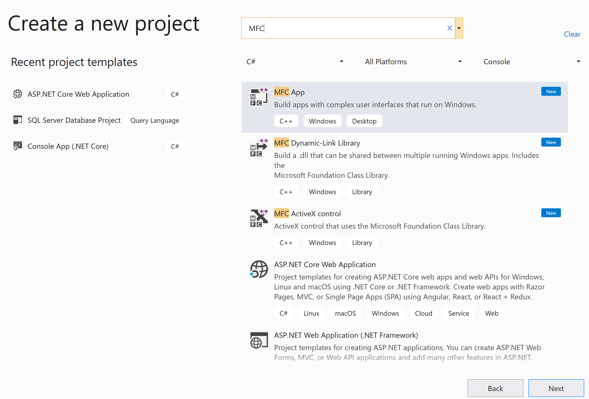
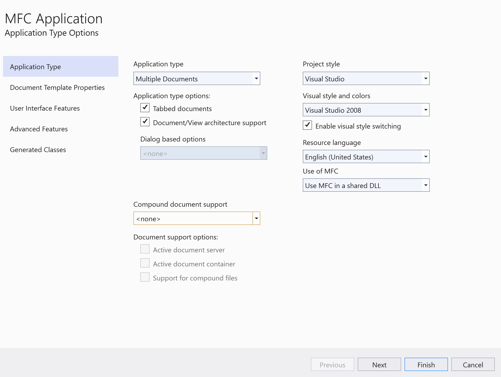
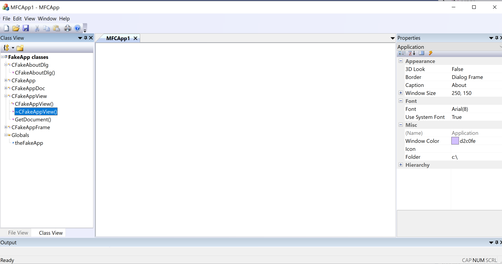
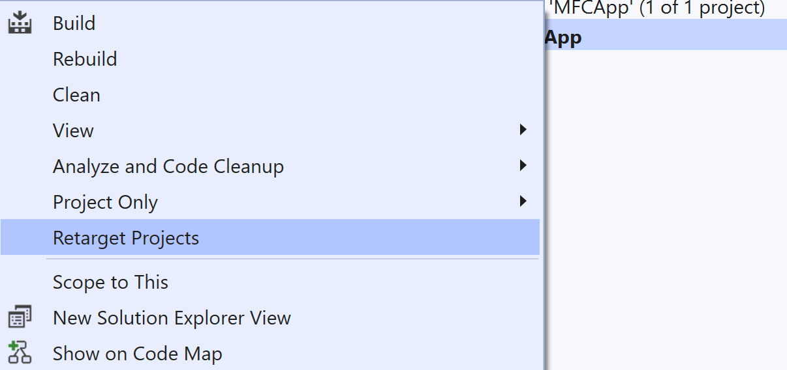
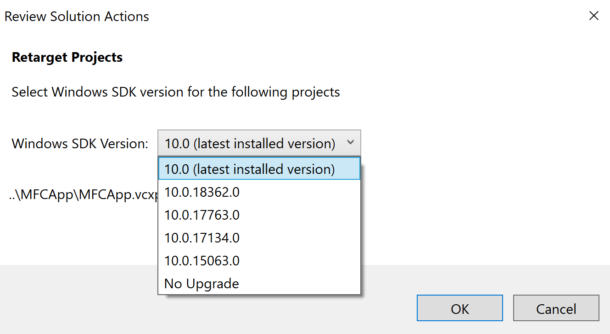
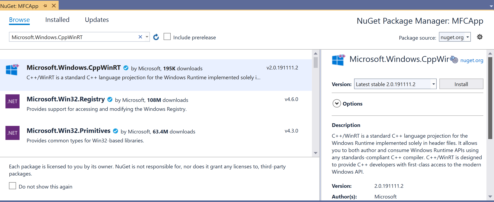
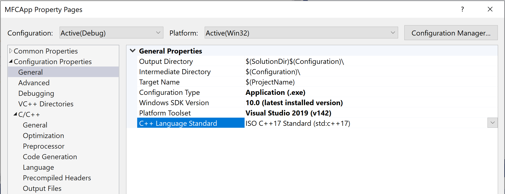
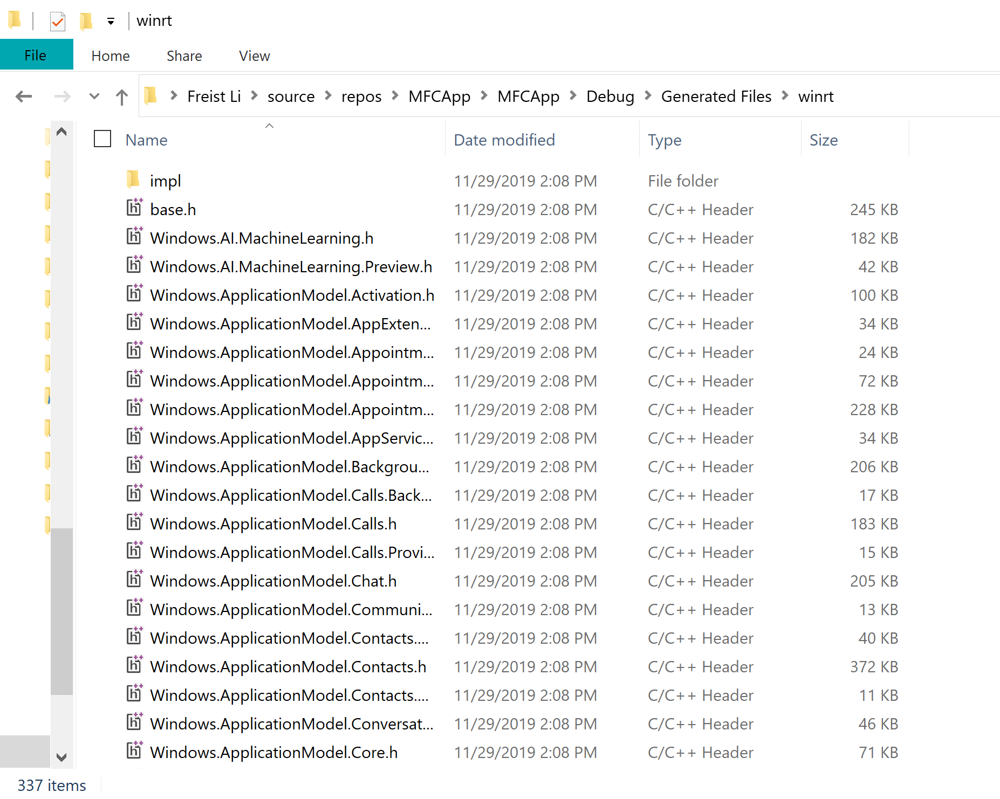
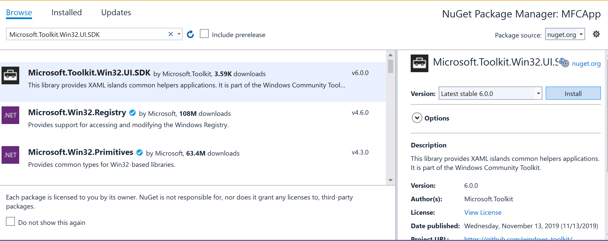

# Host standard UWP controls in MFC MDI project using XAML Islands

This article will help developers to understand how to modernize MFC MDI project with Standard UWP Controls through XMAL Islands. In this sample, we will add XAML RelativePanel, UWP Ink canvas and toolbar into the document view of this MFC MDI project.  

It brings Fluent UI to non-UWP desktops.
Although MFC uses specific framework, it does support C++/WinRT as well. It aligns the pre-requirements and API architecture described in the article Using the UWP XAML hosting API in a C++ Win32 app . Here we mainly explain the specific modernization parts for MFC project.

## Development Environment

* Visual Studio 2019 (16.3.6)  
* Windows 10 1909 (18363.476)  
* Windows 10 SDK (10.0.18362.1) 

## Configure Project

1. Create MFC App in Visual Studio 2019, will name it MFCAPP

     

    Use below configuration to create the MFCAPP project
    
      

    click **Finish** Build and Run it, here is its default UI

     

    
  
2. In Solution Explorer, right-click the MFCAPP project node,    click **Retarget Project**, select the **10.0.18362.0** or    a later SDK release, and then click OK.
 
    

    
 
3.	Install the Microsoft.Windows.CppWinRT NuGet package:

    a.	Right-click the project in Solution Explorer and choose Manage NuGet Packages.
    b.	Select the Browse tab, search for the **Microsoft.Windows.CppWinRT** package, and install the latest version of this package.  

      


    After install the nuget package, check the MFC project properties, you will notice its C++ version is ISO C++17, which is required by C++/WinRT:

    
 
    Build this MFCApp, we can see winrt projected files are generated in the “Generated Files\winrt” folder:

    
 

4.	Install the **Microsoft.Toolkit.Win32.UI.SDK** NuGet          package:

    a.	In the NuGet Package Manager window, make sure that Include prerelease is selected.  
    b.	Select the Browse tab, search for the **Microsoft.Toolkit.Win32.UI.SDK** package, and install version v6.0.0 (or Later) of this package.

    

## Use XAML hosting APIs to host  UWP controls in MFC Document View

1.  Open pch.h, add below code to include necessary winrt header files:

    ```C++
    #pragma push_macro("GetCurrentTime")
    #pragma push_macro("TRY")
    #undef GetCurrentTime
    #undef TRY

    #include <winrt/Windows.Foundation.Collections.h>
    #include <winrt/Windows.system.h>
    #include <winrt/windows.ui.xaml.hosting.h>
    #include <windows.ui.xaml.hosting.desktopwindowxamlsource.h>
    #include <winrt/windows.ui.xaml.controls.h>
    #include <winrt/Windows.ui.xaml.media.h>
    #include <winrt/Windows.UI.Core.h>
    #include <winrt/Windows.UI.Input.Inking.h>
    #include <winrt/Windows.UI.Xaml.Media.Imaging.h>
    #pragma pop_macro("TRY")
    #pragma pop_macro("GetCurrentTime")
    ```
    Regarding the reason of using “GetCurrentTime” and “TRY” macros, please refer to:
    https://docs.microsoft.com/en-us/windows/uwp/cpp-and-winrt-apis/faq

2.	Using winrt namespaces in MFCAPPView.h

    ```C++
    using namespace winrt;
    using namespace Windows::UI;
    using namespace Windows::UI::Composition;
    using namespace Windows::UI::Xaml::Hosting;
    using namespace Windows::Foundation::Numerics;
    ```

3.  In MFCAPPView.CPP, add code into the CMFCAppView::OnDraw function, it adds XAML RelativePanel, TextBox, InkCanvas, and InkToolbar, and a background image into the default document view:

    ```C++
    if (_desktopWindowXamlSource == nullptr)
        {
            //XAML Island section
            
            // This Hwnd will be the window handler for the Xaml Island: A child window that contains Xaml.  
            HWND hWndXamlIsland = nullptr;

            // This DesktopWindowXamlSource is the object that enables a non-UWP desktop application 
            // to host UWP controls in any UI element that is associated with a window handle (HWND).
            _desktopWindowXamlSource = DesktopWindowXamlSource{ };

            // Get handle to corewindow
            auto interop = _desktopWindowXamlSource.as<IDesktopWindowXamlSourceNative>();

            // Parent the DesktopWindowXamlSource object to current window
            check_hresult(interop->AttachToWindow(this->GetSafeHwnd()));

            // Get the new child window's hwnd 
            interop->get_WindowHandle(&hWndXamlIsland);

            RECT size;
            GetWindowRect(&size);
            auto viewWidth = size.right - size.left;
            auto viewHeight = size.bottom - size.top;

            //Creating the Xaml content
            Windows::UI::Xaml::Controls::RelativePanel xamlContainer;
            
            //Update the xaml island window size to view size becuase initially is 0,0
            ::SetWindowPos(hWndXamlIsland, NULL, 0, 0, viewWidth, viewHeight, SWP_SHOWWINDOW);
            
            //Add TextBox
            Windows::UI::Xaml::Controls::TextBlock tb;
            tb.Text(L"Modernized MFC");
            tb.VerticalAlignment(Windows::UI::Xaml::VerticalAlignment::Center);
            tb.HorizontalAlignment(Windows::UI::Xaml::HorizontalAlignment::Center);
            tb.FontSize(48);
            xamlContainer.Children().Append(tb);
            
            //Add background image
            Windows::UI::Xaml::Controls::Image image;
            Windows::Foundation::Uri uri(L"ms-appx:///res/viewbackground.png");
            Windows::UI::Xaml::Media::Imaging::BitmapImage bitmapImage(uri);
            image.Source(bitmapImage);

            xamlContainer.Children().Append(image);
            xamlContainer.SetAlignLeftWithPanel(image, true);
            xamlContainer.SetAlignRightWithPanel(image, true);
            xamlContainer.SetBelow(image, tb);
            
            //Add InkCanvas and InkToolbar
            Windows::UI::Xaml::Controls::InkCanvas ic;

            ic.InkPresenter().InputDeviceTypes(winrt::Windows::UI::Core::CoreInputDeviceTypes::Touch | winrt::Windows::UI::Core::CoreInputDeviceTypes::Mouse);

            Windows::UI::Xaml::Controls::InkToolbar it;
            it.TargetInkCanvas(ic);
            it.HorizontalAlignment(Windows::UI::Xaml::HorizontalAlignment::Left);
            it.VerticalAlignment(Windows::UI::Xaml::VerticalAlignment::Top);

            xamlContainer.Children().Append(ic);
            xamlContainer.Children().Append(it);

            xamlContainer.SetAlignLeftWithPanel(ic, true);
            xamlContainer.SetBelow(ic, tb);
            xamlContainer.SetAlignBottomWithPanel(ic, true);
            xamlContainer.SetAlignRightWithPanel(ic, true);

            xamlContainer.SetAlignLeftWithPanel(it, true);
            xamlContainer.SetBelow(it, tb);

            xamlContainer.UpdateLayout();
            _desktopWindowXamlSource.Content(xamlContainer);
            AdjustLayout();
        }
    ```

If  you see this error message when running the MFC app:
 
To solve it, please add one app.manifest in your project with below content:

<?xml version="1.0" encoding="UTF-8"?>
<assembly xmlns="urn:schemas-microsoft-com:asm.v1" manifestVersion="1.0">
  <compatibility xmlns="urn:schemas-microsoft-com:compatibility.v1">
    <application>
      <!-- Windows 10 -->
      <maxversiontested Id="10.0.18362.0"/>
      <supportedOS Id="{8e0f7a12-bfb3-4fe8-b9a5-48fd50a15a9a}" />
    </application>
  </compatibility>
</assembly>

 

 

 
