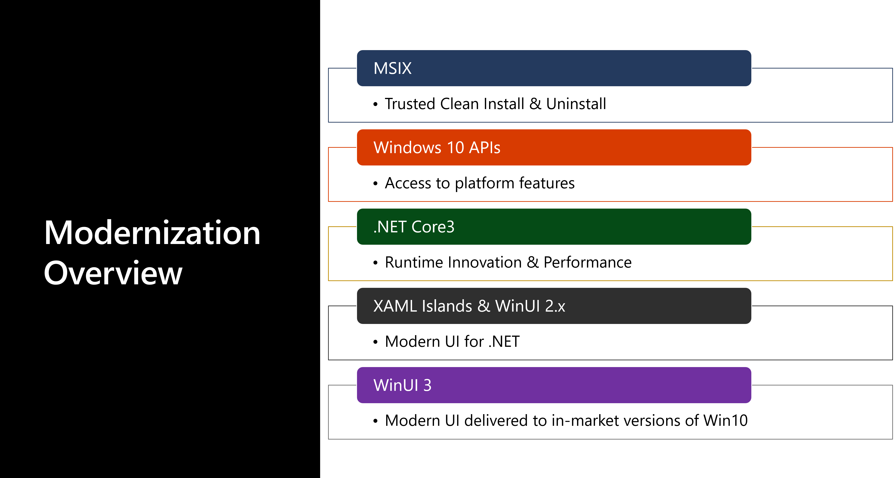

# Modernize App
A place to help Windows Developers modernize their existing applications.

  
## Integrate Standard UWP Control with MFC 
Sample: [MFCAPP](https://github.com/freistli/ModernizeApp/tree/master/MFC/MFCApp)  
Step by Step Doc: [Host standard UWP controls in MFC MDI project using XAML Islands](https://github.com/freistli/ModernizeApp/blob/master/Docs/Host%20standard%20UWP%20controls%20in%20MFC%20MDI%20project%20using%20XAML%20Islands.md)

## Integrate Customized UWP Control with MFC

Sample: [MFCAPP](https://github.com/freistli/ModernizeApp/tree/master/MFC/MFCAppWinUI)  
Step by Step Doc: [Host customized UWP controls in MFC MDI project using XAML Islands](https://github.com/freistli/ModernizeApp/blob/master/Docs/Host%20Custom%20UWP%20Controls%20in%20MFC%20MDI%20project%20using%20XMAL%20Islands.md)
